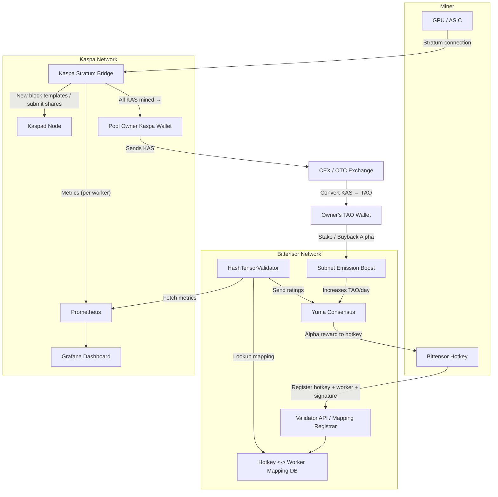

# HashTensor | Bittensor Subnet 16

## Our Mission

HashTensor’s mission is to create the most profitable crypto mining opportunities by incentivizing miners to contribute hashrate to our pools. Miners earn dual rewards and drive value back into the Alpha token through buybacks and burns.

Website: [hashtensor.com](https://hashtensor.com)  
X: [x.com/HashTensor](https://x.com/HashTensor)

## HashTensor Explained

HashTensor is a decentralized Bittensor subnet designed to track and validate mining activity across multiple proof-of-work blockchains. By introducing a model called Proof of Effective Work (PoEW), the system rewards miners not just for raw hashrate, but for performance, uptime, and reliability, allowing them to earn Alpha tokens based on their actual contribution.

## From Hashrate to Revenue

HashTensor captures the value of mining by redirecting hashrate into a performance-driven reward model that fuels Alpha’s growth through buybacks and token burns.

Here's how it works:
- Miners contribute hashrate to supported PoW networks (starting with Kaspa).
- Initially, All mined KAS is initially collected by the HashTensor wallet.
- That KAS is converted into TAO, then used to buy back Subnet 16 Alpha tokens from the open market.
- A portion of each buyback is permanently burned to reduce total supply and reinforce Alpha's deflationary nature.
- Currently, 5% of each buyback is burned. Over time, this will scale up to 90% as part of our phased fee reduction model.
- Miner fees will gradually decrease from 100% to 10%, enabling dual rewards while boosting Alpha’s value through aggressive buybacks and burns.

This model transforms raw hashrate into verifiable economic output, rewarding miners while systematically increasing the scarcity and value of Alpha over time.

### Fee & Burn Structure

Current fees percentage:
- miners fee: 100%
- ⁠buy&burn ALPHA: 5% 

Goal with the next updates: 
- miners fee: 10%
- ⁠buy&burn ALPHA: 90% 


### Coming Updates

In the upcoming monthly updates, we plan to progressively reduce the miner fee down to 10% while increasing the buy & burn percentage up to 90%. This means miners will become increasingly profitable (eventually earning dual rewards) while the alpha token will be bought and burned more aggressively.

Our goal is to reach these target thresholds within 3 to 6 months, depending on the adoption rate of the subnet. This phased approach ensures the long-term sustainability of the subnet without requiring the team to sell alpha tokens.

## The Core Commodity of HashTensor

Miners are not just mining. They are producing a next-generation form of hashrate that is measurable, verifiable, and rewarded through tokenized incentives (subnet 16 Alpha).  
This is the core commodity of HashTensor: validated, trust-scored hashrate.

## Currently Supported Cryptocurrencies

Designed to support any proof-of-work network, the subnet is capable of integrating with multiple cryptocurrencies.
The first supported coin is Kaspa (KAS). Support for additional PoW coins is planned as the subnet evolves, expanding mining opportunities across a wider range of networks.

Miners can connect their Bittensor hotkey to one or more Kaspa mining workers. The system monitors each worker’s performance and submits ratings to the Bittensor network. It is easy to configure and requires minimal setup, making HashTensor one of the easiest subnets to mine on within the Bittensor ecosystem.

## Kaspa Integration Overview

- Collects real-time data from Kaspa miners using Prometheus
- Maps Bittensor hotkeys to Kaspa workers
- Validators rate miners based on their contribution
- Rewards are distributed based on ratings and uptime

## Roadmap

- Kaspa integration as the first supported PoW coin
- Subnet launch powered by Proof of Effective Work (PoEW)
- Initial Alpha buybacks using mined KAS
- Launch HashTensor dashboard & miner leaderboard
- Start Alpha burns (initially 5% of each buyback)
- Transition to a pool-based mining model
- Progressive fee reduction from 100% to 10% miner fee
- Increase Alpha burn percentage from 5% toward 90%
- Integration of additional PoW networks beyond Kaspa

## Scoring Formula

Validators compute a score for each hotkey in four steps, producing a value between 0.0 and 1.0:

1. **Aggregation of Effective Work**
   - Sum each worker’s valid shares multiplied by its difficulty:\
     Effective Work = ∑₍worker₎ (valid\_shares × difficulty)
2. **Normalization**
   - Identify the maximum Effective Work among all hotkeys:\
     max\_work = max₍hotkey₎(Effective Work)
   - Divide each hotkey’s Effective Work by max\_work to obtain a normalized score in [0.0, 1.0]:\
     Normalized Rating = Effective Work / max\_work
3. **Uptime Penalty**
   - Compute the average uptime across a hotkey’s workers (each uptime as a fraction of the monitoring window, from 0.0 to 1.0).\
     Average Uptime = (∑₍worker₎ uptime\_fraction) / (number\_of\_workers)
   - Apply a nonlinear penalty using an exponent α (default α = 2.0):\
     Penalized Rating = Normalized Rating × (Average Uptime)^α
4. **Clamping**
   - Ensure the final score remains within [0.0, 1.0]:\
     Final Rating = max(0.0, min(1.0, Penalized Rating))

By default, a hotkey with perfect work and uptime (Normalized Rating = 1.0, Average Uptime = 1.0) will receive a score of 1.0; partial uptime or lower work reduces the rating accordingly.

---

## System Overview

Below is a high-level diagram showing how Kaspa miners, the validator, and Bittensor interact:



*Diagram: Flow of mining, metrics, mapping, and rewards between Kaspa, Bittensor, and the validator.*

---

## Subnet Registration

> **❗ Before you start:**
>
> You must create a Bittensor coldkey and hotkey, then register your hotkey in the HashTensor subnet before participating.
>
> - For the Finney network, run:
>   ```sh
>   btcli subnet register --netuid 16
>   ```
> - For the testnet, run:
>   ```sh
>   btcli subnet register --netuid 368 --network test
>   ```
>
> If you skip this step, you cannot participate in the subnet.

---

## Hardware Requirements

### Miner

- Modern GPU or ASIC (see [mining guide](docs/mining.md) for details)
- Reliable internet connection
- Sufficient system RAM and storage for mining software

Watch the full setup guide for mining on the HashTensor Subnet:
[[Watch the video]](https://www.youtube.com/watch?v=PzJQRyCHb-4)

### Validator

| Component   | Requirement                                 |
| ----------- | ------------------------------------------- |
| **CPU**     | 2+ cores                                    |
| **RAM**     | 4–8 GB (for share analysis)                 |
| **Network** | Stable connection to pool API (low latency) |
| **Storage** | Minimal (just logs & lightweight data)      |

Validators don't need GPUs — **they are not mining.**\
They just analyze data and **assign weights properly.**

---

## Get Started

- [**Miner Setup Guide**](docs/mining.md)
- [**Validator Setup Guide**](docs/validating.md)

For detailed installation and configuration instructions, please refer to the guides above.

---

## Questions

**Can multiple workers be linked to one miner hotkey?**  
Yes. A single hotkey can support multiple workers. There’s no hard limit, miners are free to connect as many workers as they like to one hotkey.

**Do validators earn KAS rewards?**  
Not directly. Validators receive Alpha for evaluating miner performance on Subnet 16. A future update may introduce validator revenue-sharing from the subnet’s earnings.

**Is all mined KAS collected by the HashTensor wallet?**  
At launch, yes. All mined KAS is collected by the subnet wallet. In future updates, we plan to introduce a pool-based system where miners receive the majority of mined KAS, with a small fee portion used for Alpha buybacks and token burns.

**When do Alpha buybacks start, and are they automated?**  
Buybacks will begin shortly after the subnet launch. Initially, they will be manual and publicly announced on our X page. 

**When and how are Alpha tokens burned?**  
Alpha burns will begin after the first buyback and are executed using Bittensor’s native burn extrinsic. All burns are transparent and verifiable on-chain.

**Will the Alpha burn percentage increase over time?**  
Yes. While buybacks initially burn a small portion of Alpha, the percentage will gradually increase toward 90% as the subnet evolves and miner fees are reduced.

**What is the burn and fee timeline?**  
The goal is to progressively reach a 10% miner fee and 90% Alpha burn ratio over the next 3–6 months, depending on adoption and network conditions.
